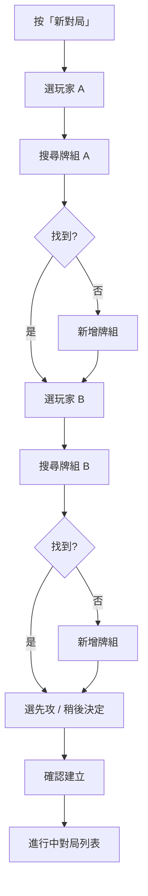
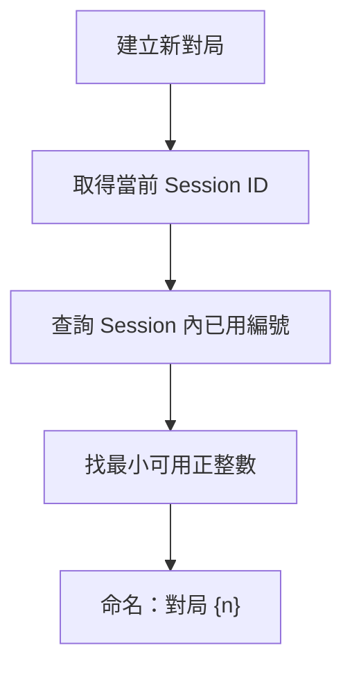
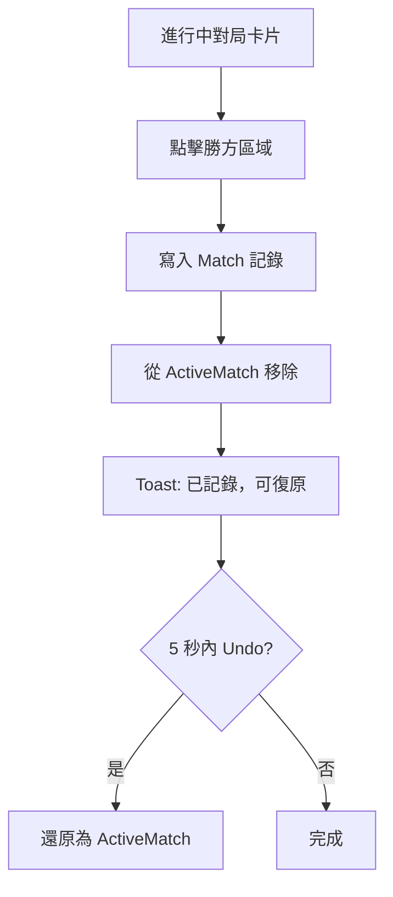
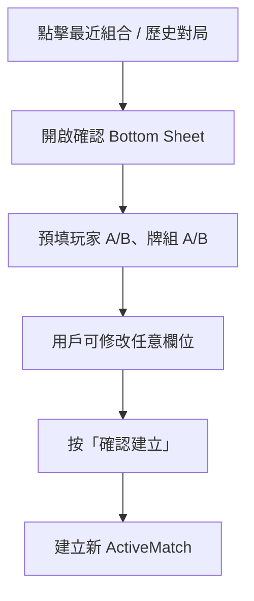
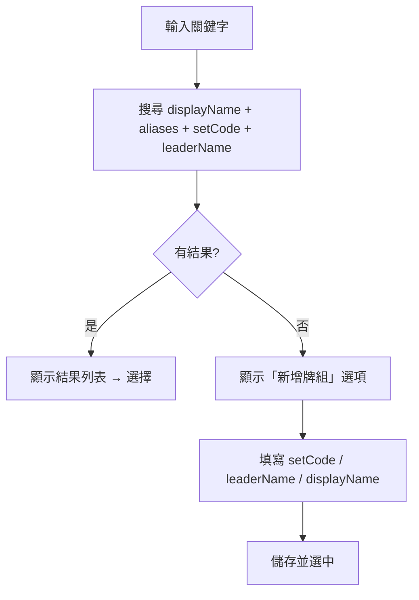
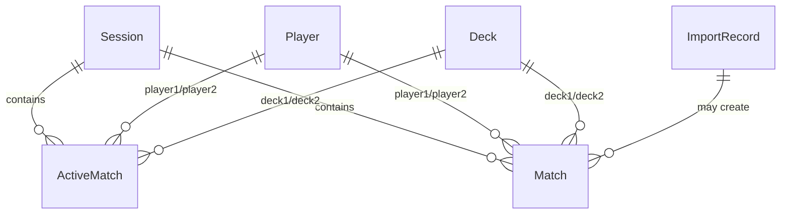

# OPCG Tracker

## 產品企劃書 / Product Plan

| 項目 | 內容 |
|------|------|
| **計劃名稱** | OPCG Tracker |
| **版本** | V2.1 Planning Document |
| **作者** | Bobby |
| **日期** | 2026-07-02 |
| **文件狀態** | Draft — 作為後續開發與改版之基礎 |
| **用途** | 卡店現場對局記錄與戰績分析工具 |

---

# 1. Executive Summary｜計劃摘要

## 1.1 計劃背景

One Piece Card Game（OPCG）在卡店與玩家社群中對戰頻繁。無論是日常店內對戰、朋友群測牌，還是小型店賽，一場 session 往往包含十數至數十場對局。現有記錄方式——紙筆、WhatsApp 訊息、或 Excel 試算表——在快節奏的現場環境中難以維持資料一致性，也無法在事後提供有價值的統計分析。

OPCG Tracker 旨在解決「記得快、記得準、看得懂」三個核心問題，讓玩家與主辦者能專注於對局本身，而非事後整理資料。

## 1.2 產品目標

> 建立一個 **mobile-first** 的 OPCG 對局記錄工具，讓玩家能快速記錄對戰、管理牌組資料，並透過統計分析理解玩家、牌組與對位表現。

具體而言：

- **現場**：30 秒內完成一場新對局的建立與記錄
- **事後**：透過篩選與統計，回答「哪副牌弱對位？」「先攻影響有多大？」「最近狀態如何？」
- **長期**：保留可遷移的結構化資料，支援匯入歷史 Excel、未來雲端同步

## 1.3 核心價值

| # | 價值 | 說明 |
|---|------|------|
| 1 | **快速記錄** | 預填、最近組合、一鍵完成；對局結束後 2 秒內寫入 |
| 2 | **減少資料混亂** | 統一玩家與牌組實體、別名機制、自動編號、防誤觸設計 |
| 3 | **實用戰績分析** | 超越單純勝率：對位矩陣、先後攻分拆、樣本量提示、趨勢追蹤 |

---

# 2. Problem Statement｜問題定義

## 2.1 現場記錄痛點

| 痛點 | 具體表現 |
|------|----------|
| 節奏快 | 一場 OPCG 對局約 15–30 分鐘，兩場之間空檔極短，記錄必須在 30 秒內完成 |
| 對局量大 | 一個下午 session 可達 20–50 場，人工記錄易漏記、重複記 |
| 事後才記 | 延遲記錄導致忘記先攻方、牌組版本、對局順序 |
| 重複填寫 | 同一批玩家反覆對戰時，每次都要重新輸入相同資訊 |
| 誤觸風險 | 手機小螢幕上，一按即建立或一按即刪除會產生錯誤資料 |

## 2.2 資料管理痛點

| 痛點 | 具體表現 |
|------|----------|
| 命名不統一 | 「OP16 黑胡」「OP16 BB」「Blackbeard OP16」指同一副牌 |
| 多別名共存 | 同一牌組在不同 Excel 欄位有不同寫法 |
| 匯入 mapping 錯 | CSV / Excel 欄位對應錯誤，整批資料污染 |
| 歷史難整理 | 跨月份、跨 session 的資料分散在多個檔案 |
| 本機遺失風險 | 僅存於單一裝置或瀏覽器，換機即失 |

## 2.3 統計分析痛點

| 痛點 | 具體表現 |
|------|----------|
| 勝率不足 | 60% 勝率若只有 3 場樣本，不具參考價值 |
| 樣本少誤導 | 1W-0L 顯示 100% 勝率，容易過度解讀 |
| 弱對位不明 | 只知道「這副牌 55%」，不知道輸給誰 |
| 玩家 vs 牌組 | 無法分辨是 deck 強還是 pilot 強 |
| 先後攻缺失 | OPCG 先攻優勢顯著，但未分拆統計 |
| 無趨勢追蹤 | 無法看「最近 10 場」vs「整體」的差異 |

---

# 3. Target Users & Use Cases｜目標用戶與使用場景

## 3.1 目標用戶

### Primary Users（主要用戶）

| 用戶 | 需求 | 使用頻率 |
|------|------|----------|
| 卡店玩家 | 記錄今日對戰、查看個人戰績 | 每週 1–3 次 |
| 朋友群測牌玩家 | 高頻對戰、比較牌組表現 | 每週 1–2 次（密集 session） |
| 小型比賽玩家 | 記錄店賽 / 交流賽結果 | 每月 1–4 次 |

### Secondary Users（次要用戶）

| 用戶 | 需求 |
|------|------|
| 卡店主辦者 | 統計店內 meta、活動後報告 |
| Team / Playtest group | 共享測牌數據、追蹤版本迭代 |
| Meta 分析玩家 | 長期累積資料、觀察環境變化 |

## 3.2 使用場景

### 場景 A：普通卡店對戰

**情境**：下午在卡店，4 位玩家輪流對戰。

**流程**：開 app → 新對局 → 選玩家與牌組 → 對戰 → 點勝方 → 完成。下一場用「最近組合」快速重開。

**成功標準**：建立 + 完成 < 20 秒；零誤觸建立。

---

### 場景 B：多人循環測牌

**情境**：5 人 loop 測牌，2 小時內 30+ 場。

**流程**：同一 session 內連續記錄；完成後查看「今日統計」——各牌組戰績、MVP 玩家。

**成功標準**：session 內對局編號連續；今日 dashboard 即時更新。

---

### 場景 C：牌組測試

**情境**：新組一副 OP16 牌，想知道對各 meta deck 的表現。

**流程**：累積 10–20 場後，進入「牌組統計 → 對位分析」，查看 matchup matrix。

**成功標準**：能一眼看出最弱 3 個對位；樣本不足時有提示。

---

### 場景 D：玩家成長追蹤

**情境**：想知道自己最近狀態是否進步。

**流程**：統計頁 → 玩家 → 選自己 → 查看「最近 10 場」vs「整體」勝率趨勢。

**成功標準**：趨勢圖清晰；可切換 N = 5 / 10 / 20。

---

### 場景 E：舊資料整理

**情境**：手上有半年 Excel 對戰紀錄，想匯入 app。

**流程**：設定 → 匯入 CSV / Excel → mapping preview → 確認 → 匯入報告。

**成功標準**：錯誤行可追蹤；raw data 保留；牌組自動合併或提示新建。

---

# 4. Product Scope｜產品範圍

## 4.1 In Scope｜包含範圍

| 類別 | 項目 |
|------|------|
| 平台 | 手機優先 Web App / PWA |
| 核心功能 | 對局建立、進行中管理、完成記錄、Undo |
| 資料管理 | 玩家管理、牌組管理（搜尋優先，非主展示頁） |
| 歷史 | 列表、篩選、編輯、軟刪除、複製為新對局 |
| 效率 | 最近組合、歷史重開（需確認）、自動對局編號 |
| 分析 | 總覽、玩家、牌組、對位、先後攻、趨勢 |
| 資料交換 | Export / Import JSON、CSV；Excel import（V2.2+） |
| 儲存 | 本機優先（localStorage → IndexedDB） |
| 擴展預留 | Schema version、migration、cloud sync 接口 |

## 4.2 Out of Scope｜暫不包含

| 項目 | 原因 |
|------|------|
| Native iOS / Android app | PWA 優先；V5 再評估 Capacitor |
| App Store / Play Store 上架 | 無審批需求；PWA Add to Home Screen 足夠 |
| 完整官方卡牌 database | 牌組以用戶自定義為主；不做 card-level 管理 |
| OCR 掃卡 | 投入產出比低；手動搜尋已足夠 |
| 公開排名 / 排行榜 | 隱私與 scope 考量；非核心需求 |
| 付款 / 訂閱 | 初期免費工具；商業模式未定 |
| 即時多人協作 | V4 Team workspace 再考慮 |
| 賽事 bracket 管理 | 專注對局記錄，非賽事系統 |

---

# 5. Product Strategy｜產品策略

## 5.1 Web App / PWA 優先

**選擇理由：**

- 開發與部署週期短（Vite + Vercel 數日可出 MVP）
- 跨平台：iOS Safari、Android Chrome、桌面瀏覽器均可使用
- 更新即時：無需 App Store 審批
- 可漸進增強：localStorage → IndexedDB → Service Worker → PWA install
- 未來可用 Capacitor 包裝為 native app，程式碼复用率高

## 5.2 Offline-first Strategy

**原則：**

```
用戶操作 → 寫入本機 → UI 即時更新 → （未來）背景同步雲端
```

- 卡店 Wi-Fi 不穩定是常態；對局記錄 **�絕不** 因網絡失敗而遺失
- Phase 1–3 完全離線可用
- Phase 4 加入 Supabase sync 時，以本機為 source of truth，conflict 時提示用戶

## 5.3 Mobile-first Design

| 原則 | 實作方向 |
|------|----------|
| 單手操作 | 主要 CTA 置於螢幕下半部 |
| 大按鈕 | 完成對局、選擇勝方 ≥ 48px touch target |
| 少輸入 | 搜尋 + 選擇，避免自由文字為主 |
| 防誤觸 | 快速重開需確認 sheet；刪除需二次確認 |
| Bottom sheet | 選玩家、選牌組、確認建立 |
| 快速完成 | 進行中對局卡片 → 點勝方 → 完成（2 步） |

---

# 6. Information Architecture｜資訊架構

## 6.1 Bottom Navigation

```text
┌─────────┬─────────┬─────────┬─────────┐
│  記錄   │  統計   │  歷史   │  設定   │
│ Record  │  Stats  │ History │ Settings│
└─────────┴─────────┴─────────┴─────────┘
```

- **記錄**：最高頻入口，預設 landing page
- **統計**：次高頻，session 結束後查看
- **歷史**：查詢與修正
- **設定**：低頻，含管理與匯入匯出

## 6.2 記錄頁（Record）

```text
記錄頁
├── [+ 新對局]                    ← Primary CTA
├── 進行中對局列表
│   └── 對局卡片（點擊 → 完成 / 編輯）
├── 最近組合（Quick Restart）
│   └── 組合卡片（點擊 → 確認 Sheet → 建立）
└── 今日摘要（可選，場數 / 勝率）
```

**關鍵互動：**

- 新對局 → Bottom sheet 多步表單
- 完成對局 → 點勝方 → Toast「已記錄，可復原（5 秒）」
- Undo → 5 秒內可撤銷最後一場完成

## 6.3 統計頁（Stats）

```text
統計頁
├── Tab: 總覽 | 玩家 | 牌組 | 對位 | 趨勢
├── 篩選列：日期範圍 | Session | 玩家 | 牌組
└── 內容區（依 Tab 切換圖表與表格）
```

| Tab | 主要內容 |
|-----|----------|
| 總覽 | Summary cards、今日 MVP、常見 matchup |
| 玩家 | 勝率排行、W-L、最近 N 場 |
| 牌組 | 勝率 / 使用量 bar chart、勝率 vs 使用量 scatter |
| 對位 | Matchup matrix、單牌組對位詳情 |
| 趨勢 | 每日場數、勝率折線、learning curve |

## 6.4 歷史頁（History）

```text
歷史頁
├── 篩選：日期 | 玩家 | 牌組 | Session
├── 對局列表（倒序）
│   └── 每行：編號 | 玩家 vs 玩家 | 牌組 vs 牌組 | 勝方 | 先攻 | 時間
└── 操作：編輯 | 軟刪除 | 複製為新對局
```

## 6.5 設定頁（Settings）

```text
設定頁
├── 玩家管理（新增 / 編輯 / 別名 / 封存）
├── 牌組管理（新增 / 編輯 / 別名 / 顏色 / 封存）
├── 資料
│   ├── 匯出 JSON
│   ├── 匯出 CSV
│   ├── 匯入 JSON / CSV / Excel
│   └── 手動備份
├── 關於
│   ├── Schema version
│   ├── App version
│   └── 備份提醒設定
└── （未來）雲端同步設定
```

---

# 7. Core User Flow｜核心使用流程

## 7.1 新增對局流程



**時間目標**：≤ 15 秒（熟悉用戶 + 最近組合預填）

## 7.2 自動對局編號流程



**規則：**

- 編號在 Session 範圍內唯一
- 軟刪除的對局編號 **不回收**（避免混淆）
- 新 Session 編號從 1 重新開始

## 7.3 完成對局流程



## 7.4 快速重開流程



**防誤觸**：禁止一按即建立；Sheet 外點擊 = 取消。

## 7.5 牌組搜尋 / 新增流程



**搜尋範例：**

| 輸入 | 匹配 |
|------|------|
| `OP16` | 所有 setCode = OP16 的牌組 |
| `黑胡` | displayName 或 alias 含「黑胡」 |
| `BB` | alias 或 leaderCode 含 BB |

---

# 8. Functional Requirements｜功能需求

## 8.1 對局記錄模組

| ID | 功能 | 優先級 | 驗收標準 |
|----|------|--------|----------|
| M-01 | 建立進行中對局 | P0 | 必填：player1, deck1, player2, deck2 |
| M-02 | 自動對局編號 | P0 | Session 內唯一遞增 |
| M-03 | 記錄先攻方 | P1 | 可選；支援「稍後決定」 |
| M-04 | 完成對局 | P0 | 點擊勝方即完成 |
| M-05 | Undo 完成 | P0 | 5 秒窗口；僅限最後一場 |
| M-06 | 軟刪除 | P1 | 設 deletedAt；不物理刪除 |
| M-07 | 編輯進行中對局 | P1 | 可改玩家 / 牌組 / 先攻 |
| M-08 | 備註 notes | P2 | 可選文字欄位 |

## 8.2 快速建立模組

| ID | 功能 | 優先級 | 驗收標準 |
|----|------|--------|----------|
| Q-01 | 最近組合列表 | P0 | 顯示最近 5 組 player+deck 組合 |
| Q-02 | 歷史對局複製 | P1 | 從 History 一鍵複製 |
| Q-03 | 預填確認 Sheet | P0 | 必須確認才建立 |
| Q-04 | 禁止一按即建立 | P0 | 無確認步驟不可建立 |

## 8.3 玩家管理模組

| ID | 功能 | 優先級 | 驗收標準 |
|----|------|--------|----------|
| P-01 | 新增玩家 | P0 | name 必填、唯一（大小寫不敏感） |
| P-02 | 編輯玩家 | P1 | 可改 name |
| P-03 | 玩家別名 | P1 | aliases[] 陣列；搜尋時匹配 |
| P-04 | 封存玩家 | P2 | archived=true；不出現在新對局選單 |
| P-05 | 最近使用牌組 | P2 | 選玩家時優先顯示其常用 deck |

## 8.4 牌組管理模組

| ID | 功能 | 優先級 | 驗收標準 |
|----|------|--------|----------|
| D-01 | 搜尋牌組 | P0 | 模糊匹配 displayName / aliases / setCode / leaderName |
| D-02 | 新增牌組 | P0 | 至少 displayName 必填 |
| D-03 | 編輯牌組 | P1 | 可改所有欄位 |
| D-04 | 牌組別名 | P1 | aliases[] 支援多別名 |
| D-05 | 顏色標記 | P2 | colors[] 如 ["Red", "Green"] |
| D-06 | Set code | P1 | setCode 如 "OP16" |
| D-07 | Leader name | P1 | leaderName 如 "Blackbeard" |
| D-08 | 封存牌組 | P2 | archived=true |

**設計原則：** 牌組 **不是** 主展示頁。牌組出現於：

1. 新對局 → 搜尋選擇
2. 設定 → 管理列表
3. 統計 → 分析維度

## 8.5 歷史記錄模組

| ID | 功能 | 優先級 | 驗收標準 |
|----|------|--------|----------|
| H-01 | 完成對局列表 | P0 | 倒序；分頁或 infinite scroll |
| H-02 | 日期篩選 | P1 | 今日 / 本週 / 自訂範圍 |
| H-03 | 玩家篩選 | P1 | 單選或多選 |
| H-04 | 牌組篩選 | P1 | 單選或多選 |
| H-05 | 編輯 | P1 | 可改任意欄位（標記 source=manual_edit） |
| H-06 | 軟刪除 | P1 | 確認後設 deletedAt |
| H-07 | 複製為新對局 | P1 | 走快速重開流程 |

## 8.6 統計分析模組

### 8.6.1 總覽 Dashboard

| 指標 | 計算方式 |
|------|----------|
| 總場數 | count(Match where deletedAt is null) |
| 先攻勝率 | firstPlayerWin / totalWithFirstPlayer |
| 今日最常用牌組 | mode(deckId) where date = today |
| 最多勝玩家 | max(wins) by playerId |
| 最常見 matchup | mode(deck1Id, deck2Id) pair |

### 8.6.2 玩家統計

| 指標 | 說明 |
|------|------|
| 勝率 | wins / (wins + losses) |
| W-L | 勝場數 - 敗場數 |
| 最近 N 場 | 滑動窗口 win rate，N = 5 / 10 / 20 |
| 使用牌組表現 | 該玩家用各 deck 的 sub-stats |
| 苦手玩家 | 對特定 player 勝率最低 |
| 玩家對玩家 | Head-to-head matrix |

### 8.6.3 牌組統計

| 指標 | 說明 |
|------|------|
| 牌組勝率 | deck wins / deck appearances |
| 使用量 | count(matches featuring deck) |
| 勝率 bar chart | 橫向 bar，附場數 label |
| 使用量 bar chart | 橫向 bar |
| 勝率 vs 使用量 | scatter plot（bubble size = 場數） |
| 不同玩家表現 | 同一 deck 分 player 的 sub-table |

### 8.6.4 對位分析

| 指標 | 說明 |
|------|------|
| 單牌組對位詳情 | Deck X vs all：win rate per opponent deck |
| Matchup matrix | N×N heatmap（deck vs deck） |
| 最弱對位 | win rate 最低且場數 ≥ 3 |
| 最強對位 | win rate 最高且場數 ≥ 3 |

### 8.6.5 先後攻分析

| 指標 | 說明 |
|------|------|
| 全體先攻勝率 | 全局 first player win rate |
| 玩家先後攻 | per player split |
| 牌組先後攻 | per deck split |
| 對位先後攻 | per matchup split |

### 8.6.6 趨勢分析

| 指標 | 說明 |
|------|------|
| 每日場數 | bar chart by date |
| 最近 N 場勝率 | rolling window line chart |
| 玩家勝率趨勢 | per player rolling win rate |
| 牌組勝率趨勢 | per deck rolling win rate |
| Learning curve | 某 deck 累積場數 vs 勝率 |

## 8.7 匯入 / 匯出模組

| ID | 功能 | 版本 | 說明 |
|----|------|------|------|
| IO-01 | Export JSON | V2 | 完整 AppState dump |
| IO-02 | Import JSON | V2 | 含 schema version check + migration |
| IO-03 | Export CSV | V2.2 | 扁平化 Match 列表 |
| IO-04 | Import CSV | V2.2 | 欄位 mapping |
| IO-05 | Import Excel | V2.2 | .xlsx via SheetJS |
| IO-06 | Mapping preview | V3 | 匯入前預覽 + 確認 |
| IO-07 | Raw data 保留 | V3 | ImportRecord 存原始行 |
| IO-08 | 錯誤報告 | V2.2 | 逐行 error / warning |

## 8.8 備份與同步模組

### 短期（V2–V3）

| 功能 | 說明 |
|------|------|
| 本機儲存 | localStorage → IndexedDB |
| 手動備份 JSON | 一鍵下載 |
| 備份提醒 | 每 N 天或每 N 場提醒 |

### 長期（V4+）

| 功能 | 說明 |
|------|------|
| Supabase sync | 背景 push / pull |
| 多裝置同步 | 同一 account 多 device |
| Team workspace | 共享 session |
| Conflict resolution | Last-write-wins + manual merge UI |

---

# 9. Analytics Design｜統計展示設計

## 9.1 Summary Cards

```
┌──────────┐ ┌──────────┐ ┌──────────┐ ┌──────────┐
│  總場數   │ │  勝率    │ │ 先攻勝率  │ │ 今日 MVP │
│   127    │ │  52.3%   │ │  58.1%   │ │  Alex    │
│          │ │  (66W)   │ │  (n=89)  │ │  8W-2L   │
└──────────┘ └──────────┘ └──────────┘ └──────────┘
```

## 9.2 Bar Charts

- **牌組勝率**：Y = deck name，X = win rate (0–100%)，label = "12W-8L"
- **牌組使用量**：Y = deck name，X = count
- **玩家勝率**：同上

## 9.3 Matchup Table

**單牌組對位表（Deck X）：**

| vs | 場數 | 勝 | 負 | 勝率 | 可靠度 |
|----|------|----|----|------|--------|
| OP16 路飛 | 8 | 5 | 3 | 62.5% | ●●● |
| OP16 黑胡 | 3 | 0 | 3 | 0% | ● |
| OP15 赤犬 | 6 | 4 | 2 | 66.7% | ●● |

**完整 Matchup Matrix：**

- Heatmap：綠 = 高勝率，紅 = 低勝率
- 對角線留空（同 deck 不對戰）
- Cell 顯示 win rate + (n)

## 9.4 Player × Deck Table

| 玩家 | OP16 路飛 | OP16 黑胡 | OP15 赤犬 |
|------|-----------|-----------|-----------|
| Alex | 8W-2L 80% | 3W-5L 38% | — |
| Bob | 2W-3L 40% | 5W-1L 83% | 4W-2L 67% |

## 9.5 Trend Charts

- **每日場數**：bar chart，X = date，Y = count
- **勝率變化**：line chart，X = match index (recent 20)，Y = cumulative win rate
- **最近 N 場**：toggle N = 5 / 10 / 20

## 9.6 Reliability Display（樣本量提示）

| 場數 | 標籤 | 視覺 |
|------|------|------|
| 0 | 無資料 | 灰色 |
| 1–2 | 樣本不足 | ●  + 警告 icon |
| 3–5 | 初步參考 | ●● |
| 6–10 | 參考 | ●●● |
| 11+ | 較可信 | ●●●● |

**原則：** 任何 win rate 顯示必須 **同時** 顯示場數 (n)。

---

# 10. Data Model｜資料模型

## 10.1 Core Entities

```text
Player          玩家
Deck            牌組
Session         對局時段（如「2026-07-02 卡店」）
ActiveMatch     進行中對局
Match           已完成對局
ImportRecord    匯入紀錄
AppState        應用狀態（含 schemaVersion）
```

**Entity Relationship：**



## 10.2 Player

```typescript
interface Player {
  id: string;              // UUID v4
  name: string;            // 顯示名稱，唯一（case-insensitive）
  aliases: string[];       // 別名列表
  archived: boolean;       // default: false
  createdAt: string;       // ISO 8601
  updatedAt: string;
}
```

## 10.3 Deck

```typescript
interface Deck {
  id: string;
  setCode: string;         // e.g. "OP16"
  leaderCode: string;      // e.g. "OP16-001"（可選）
  leaderName: string;      // e.g. "Blackbeard"
  colors: string[];        // e.g. ["Black", "Yellow"]
  displayName: string;     // e.g. "OP16 黑胡"
  aliases: string[];       // e.g. ["BB", "黑鬍子"]
  archived: boolean;
  createdAt: string;
  updatedAt: string;
}
```

## 10.4 Session

```typescript
interface Session {
  id: string;
  name: string;            // e.g. "2026-07-02 卡店"
  startedAt: string;
  endedAt: string | null;  // null = 進行中
  createdAt: string;
}
```

## 10.5 ActiveMatch

```typescript
interface ActiveMatch {
  id: string;
  sessionId: string;
  matchNumber: number;     // Session 內編號
  player1Id: string;
  deck1Id: string;
  player2Id: string;
  deck2Id: string;
  firstPlayerId: string | null;  // null = 未決定
  startedAt: string;
  notes: string | null;
}
```

## 10.6 Match

```typescript
interface Match {
  id: string;
  sessionId: string;
  matchNumber: number;
  player1Id: string;
  deck1Id: string;
  player2Id: string;
  deck2Id: string;
  winnerPlayerId: string;
  winnerDeckId: string;
  firstPlayerId: string | null;
  resultType: 'normal' | 'draw' | 'forfeit';  // default: 'normal'
  startedAt: string;
  finishedAt: string;
  source: 'manual' | 'import' | 'manual_edit';
  deletedAt: string | null;
  notes: string | null;
}
```

## 10.7 ImportRecord

```typescript
interface ImportRecord {
  id: string;
  filename: string;
  importedAt: string;
  totalRows: number;
  successCount: number;
  errorCount: number;
  errors: Array<{ row: number; message: string }>;
  rawData: string;         // 原始檔案內容或 hash
}
```

## 10.8 AppState

```typescript
interface AppState {
  schemaVersion: number;   // current: 2
  appVersion: string;      // e.g. "2.1.0"
  currentSessionId: string | null;
  players: Player[];
  decks: Deck[];
  sessions: Session[];
  activeMatches: ActiveMatch[];
  matches: Match[];
  importRecords: ImportRecord[];
  settings: {
    lastBackupReminder: string | null;
    backupReminderIntervalDays: number;  // default: 7
  };
}
```

## 10.9 Schema Versioning

```json
{
  "schemaVersion": 2,
  "appVersion": "2.1.0"
}
```

**Migration 策略：**

| From | To | 變更 |
|------|-----|------|
| 1 | 2 | 新增 Deck entity；Match 加入 deck1Id/deck2Id |
| 2 | 3 | localStorage → IndexedDB；新增 ImportRecord |

Migration 在 app 啟動時自動執行；失敗時保留原資料並顯示錯誤。

---

# 11. UX / UI Design Principles｜設計原則

## 11.1 快速優先

- 新對局表單 ≤ 5 步
- 預填最近使用的前 3 個玩家 / 牌組
- 先攻可選「稍後決定」，不阻擋建立
- 非必要欄位（notes）摺疊或省略

## 11.2 防誤觸

| 動作 | 保護機制 |
|------|----------|
| 快速重開 | 必須確認 Sheet |
| 完成對局 | 5 秒 Undo window |
| 刪除 | Soft delete + 確認 dialog |
| 匯入 | Preview + 確認 |
| 清空資料 | 雙重確認 + 輸入確認文字 |

## 11.3 Mobile-first

- Viewport：375px 為基準設計
- Touch target：≥ 48 × 48 px
- Bottom sheet：佔螢幕 60–80%
- Sticky action bar：完成 / 確認按鈕固定底部
- 圖表：支援橫向 scroll

## 11.4 資料可信度提示

- **黃金法則**：勝率必須配合場數顯示
- 樣本 ≤ 2：顯示警告「樣本不足，僅供參考」
- 1W-0L：不顯示 100%，改顯示「1W-0L（樣本不足）」
- 統計頁預設 filter：僅顯示場數 ≥ 3 的對位（可 toggle 關閉）

---

# 12. Technical Architecture｜技術架構

## 12.1 Recommended Stack

| 層級 | 技術 | 理由 |
|------|------|------|
| Framework | React 18 + TypeScript | 生態成熟、型別安全 |
| Build | Vite | 快速 HMR、小 bundle |
| Styling | Tailwind CSS | Mobile-first utility、快速迭代 |
| State | Zustand 或 React Context | 輕量；AppState 為 single source |
| Storage | Dexie.js (IndexedDB) | 結構化查詢、大容量 |
| Charts | Recharts 或 Chart.js | React 友好 |
| PWA | vite-plugin-pwa | Service Worker + manifest |
| Deploy | Vercel | Git push 即 deploy |
| Future DB | Supabase (PostgreSQL) | Auth + realtime + RLS |

## 12.2 Storage Strategy

```text
Phase 1 (V1)        localStorage          原型驗證
Phase 2 (V2)        localStorage          功能完整
Phase 3 (V3)        IndexedDB / Dexie     容量 + 查詢
Phase 4 (V4)        IndexedDB + Supabase  雲端同步
```

**Dexie Schema 草案：**

```typescript
class OPCGDatabase extends Dexie {
  players!: Table<Player>;
  decks!: Table<Deck>;
  sessions!: Table<Session>;
  activeMatches!: Table<ActiveMatch>;
  matches!: Table<Match>;
  importRecords!: Table<ImportRecord>;
  meta!: Table<{ key: string; value: unknown }>;

  constructor() {
    super('OPCGTracker');
    this.version(1).stores({
      players: 'id, name',
      decks: 'id, displayName, setCode, *aliases',
      sessions: 'id, startedAt',
      activeMatches: 'id, sessionId',
      matches: 'id, sessionId, finishedAt, player1Id, player2Id, deck1Id, deck2Id',
      importRecords: 'id, importedAt',
      meta: 'key',
    });
  }
}
```

## 12.3 Deployment Strategy

```text
GitHub repo
    ↓ push to main
Vercel auto-deploy
    ↓
HTTPS PWA
    ↓
Add to Home Screen (iOS / Android)
```

**環境：**

| 環境 | URL | 用途 |
|------|-----|------|
| Production | opcg-tracker.vercel.app | 正式使用 |
| Preview | *.vercel.app | PR preview |
| Local | localhost:5173 | 開發 |

## 12.4 專案結構（建議）

```text
opcg-tracker/
├── docs/
│   └── OPCG-Tracker-Product-Plan-V2.1.md
├── public/
│   ├── manifest.json
│   └── icons/
├── src/
│   ├── components/
│   │   ├── record/
│   │   ├── stats/
│   │   ├── history/
│   │   ├── settings/
│   │   └── ui/              # 共用 UI（Button, Sheet, Toast）
│   ├── hooks/
│   ├── stores/              # Zustand stores
│   ├── db/                  # Dexie setup + migrations
│   ├── lib/
│   │   ├── stats/           # 統計計算邏輯
│   │   ├── import/          # CSV / Excel parser
│   │   └── export/
│   ├── types/
│   └── App.tsx
├── package.json
├── vite.config.ts
├── tailwind.config.js
└── tsconfig.json
```

---

# 13. Version Roadmap｜版本路線圖

## V1 — 最小可用（MVP）

**目標**：能記、能看、能重賽

- [x] 單場記錄（玩家 + 勝方）
- [x] 基本歷史列表
- [x] 今日 / 全部 filter
- [x] 一鍵重賽（同組合）

## V2 — 結構化資料

**目標**：牌組模型、Session、基本統計

- [ ] Session dashboard
- [ ] Active match（進行中狀態）
- [ ] Deck entity + 牌組欄位
- [ ] 基本統計（總場數、勝率）
- [ ] Export JSON

## V2.1 — 現場體驗優化（當前規劃版本）

**目標**：快、準、防誤觸

- [ ] 牌組不作主展示；新對局內搜尋
- [ ] 自動對局編號
- [ ] 快速重開需確認 Sheet
- [ ] 完成後 Undo（5 秒）
- [ ] 改善統計頁 layout
- [ ] 最近組合列表

## V2.2 — 進階分析

**目標**：對位、先後攻、匯入

- [ ] 玩家 × 牌組分析表
- [ ] 單牌組對位表
- [ ] 先後攻分拆統計
- [ ] 最近 N 場滑動窗口
- [ ] CSV export
- [ ] CSV / Excel import + 錯誤報告

## V3 — 基礎設施

**目標**：PWA、IndexedDB、進階圖表

- [ ] Migrate to IndexedDB / Dexie
- [ ] PWA install prompt
- [ ] 匯入 mapping preview
- [ ] Matchup matrix heatmap
- [ ] 趨勢圖表
- [ ] 備份提醒

## V4 — 雲端同步

**目標**：多裝置、Team

- [ ] Supabase setup（auth + DB）
- [ ] 背景 sync
- [ ] 多裝置
- [ ] Team / Group workspace
- [ ] Conflict resolution UI
- [ ] Cloud backup

## V5 — Native（可選）

**目標**：App Store 可選上架

- [ ] Capacitor wrapper
- [ ] Push notification（備份提醒）
- [ ] App Store / Play Store（可選）

---

# 14. Risks & Limitations｜風險與限制

## 14.1 資料風險

| 風險 | 影響 | 緩解 |
|------|------|------|
| 本機資料消失 | 全部戰績遺失 | 備份提醒、Export JSON、未來 cloud sync |
| 瀏覽器清 cache | IndexedDB 被清 | PWA install 降低被清機率；定期備份 |
| 匯入污染 | 錯誤資料進入 | Preview + 錯誤報告 + 可 rollback |

## 14.2 統計風險

| 風險 | 影響 | 緩解 |
|------|------|------|
| 樣本少誤導 | 錯誤決策 | Reliability display、預設 filter |
| 玩家水平混淆 | deck 強 vs pilot 強 | Player × Deck 分拆表 |
| Meta 變動 | 舊資料不適用 | 日期篩選、版本標記（未來） |
| 操縱資料 | 刻意只記贏的 | 誠信問題；非技術可解 |

## 14.3 技術風險

| 風險 | 影響 | 緩解 |
|------|------|------|
| iOS PWA 限制 | 無 push、storage 限 50MB | 告知用戶；V5 native 備選 |
| IndexedDB migration | 升級失敗 | 備份後 migration；rollback 機制 |
| 多裝置 sync conflict | 資料不一致 | Last-write-wins + manual merge |
| Excel 格式多樣 | 匯入失敗 | Mapping UI + raw data 保留 |

---

# 15. Success Metrics｜成功指標

## 15.1 使用效率

| 指標 | 目標 | 量度方式 |
|------|------|----------|
| 建立對局時間 | < 15 秒 | 從點「新對局」到建立完成 |
| 完成對局時間 | < 2 秒 | 從點勝方到 Toast 顯示 |
| 重開對局時間 | < 5 秒 | 從點最近組合到建立完成 |

## 15.2 資料品質

| 指標 | 目標 |
|------|------|
| 牌組命名重複率 | < 10%（同 deck 多於 2 個 name） |
| 錯誤記錄可復原 | Undo 成功率 100%（5 秒內） |
| 匯入錯誤可追蹤 | 100% 錯誤行有 message |

## 15.3 分析價值

| 指標 | 驗收標準 |
|------|----------|
| 弱对位识别 | 用戶能在 10 秒內找到某 deck 最弱 3 个对位 |
| 玩家 vs 牌組 | Player × Deck 表可區分 pilot 差異 |
| 趨勢追蹤 | 可切換最近 5 / 10 / 20 場並看到差異 |

---

# 16. Appendix｜附錄

## 16.1 名詞定義

| 名詞 | 定義 |
|------|------|
| OPCG | One Piece Card Game，海賊王卡牌對戰遊戲 |
| Session | 一個連續的對局時段，如「2026-07-02 下午卡店」 |
| Match | 一場完成的 1v1 對局 |
| ActiveMatch | 進行中、尚未記錄勝負的對局 |
| Deck | 一副牌組，以 leader + set 為識別 |
| Matchup | 兩副牌組之間的對戰關係 |
| 先攻 (First Player) | OPCG 中先開始回合的玩家 |
| 對位 | 特定 deck vs 特定 deck 的勝負統計 |
| Soft Delete | 設 deletedAt 標記，不物理刪除 |
| Meta | 當前環境中流行的牌組類型 |

## 16.2 統計公式

**勝率（Win Rate）：**

```
winRate = wins / (wins + losses)
```

- Draw 和 Forfeit 不計入 winRate 分母（可選：forfeit 計入 loss）
- 未記先攻的 match 不計入先攻統計

**最近 N 場勝率（Rolling Win Rate）：**

```
recentWinRate(N) = wins in last N matches / min(N, total matches)
```

**先攻勝率（First Player Win Rate）：**

```
firstPlayerWinRate = matches where firstPlayer won / matches with firstPlayer recorded
```

**對位勝率（Matchup Win Rate）：**

```
matchupWinRate(deckA, deckB) = deckA wins vs deckB / total matches (deckA vs deckB)
```

注意：deckA vs deckB 與 deckB vs deckA 視為同一 matchup（normalize pair order）。

## 16.3 Excel 欄位 Mapping 範例

**常見 Excel 格式：**

| 日期 | 玩家A | 牌組A | 玩家B | 牌組B | 勝方 | 先攻 |
|------|-------|-------|-------|-------|------|------|
| 2026-07-01 | Alex | OP16路飛 | Bob | OP16黑胡 | Alex | Alex |

**Mapping 設定：**

```json
{
  "columnMapping": {
    "date": "日期",
    "player1": "玩家A",
    "deck1": "牌組A",
    "player2": "玩家B",
    "deck2": "牌組B",
    "winner": "勝方",
    "firstPlayer": "先攻"
  },
  "deckMatching": "fuzzy",
  "playerMatching": "fuzzy",
  "createMissing": true
}
```

**匯入邏輯：**

1. 解析每一行
2. Fuzzy match player → 找到用 ID，找不到则新建
3. Fuzzy match deck → 找到用 ID，找不到则新建（或提示）
4. 判斷 winner → 對應 player1 或 player2
5. 寫入 Match（source = 'import'）
6. 錯誤行記錄到 ImportRecord.errors

## 16.4 未來功能清單（Backlog）

| 功能 | 優先級 | 版本 |
|------|--------|------|
| 多語言（EN / 繁中） | P2 | V3 |
| Dark mode | P2 | V3 |
| Deck 版本追蹤（sideboard 變更） | P3 | V4 |
| 自動 Session 偵測（超過 4 小時自動分段） | P3 | V3 |
| 分享統計截圖 | P3 | V3 |
| QR code 匯入 / 匯出 | P3 | V4 |
| 官方 card database 整合 | P4 | TBD |
| 公開 meta 報告 | P4 | TBD |

## 16.5 Wireframe 備註

正式 wireframe 待 V2.1 開發前以 Figma 製作。以下為文字描述：

**記錄頁：**

```text
┌─────────────────────────────┐
│  OPCG Tracker        [⚙]   │
├─────────────────────────────┤
│  ┌─────────────────────┐   │
│  │    ＋ 新對局          │   │  ← Primary button, full width
│  └─────────────────────┘   │
│                             │
│  進行中 (2)                  │
│  ┌─────────────────────┐   │
│  │ 對局 3               │   │
│  │ Alex OP16路飛 vs      │   │
│  │ Bob  OP16黑胡         │   │
│  │ [Alex 勝] [Bob 勝]    │   │  ← 大按鈕選勝方
│  └─────────────────────┘   │
│                             │
│  最近組合                    │
│  ┌─────────────────────┐   │
│  │ Alex+路飛 vs Bob+黑胡 │   │
│  └─────────────────────┘   │
├─────────────────────────────┤
│  記錄 │ 統計 │ 歷史 │ 設定  │
└─────────────────────────────┘
```

---

## 文件修訂紀錄

| 版本 | 日期 | 作者 | 變更 |
|------|------|------|------|
| V2.1 Draft | 2026-07-02 | Bobby | 初版計劃書，基於 V2.1 功能規劃 |

---

*本文件為 OPCG Tracker 產品計劃書與技術規格之混合文檔，供後續開發、AI code generation、及團隊協作之基礎參考。*
