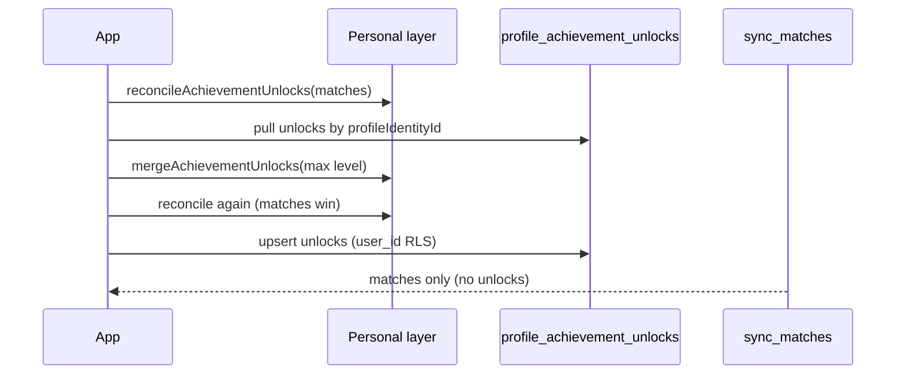

# V4.16+ Roadmap（重排版）

基準：**V4.15.1**（2026-07-12）。本文件取代 `ROADMAP.md` 中 V4.4–4.5 草案排程。

## 設計原則（一勞永逸）

研究結論（PowerSync / event-sourcing / offline-first 成就）與本專案現況對齊：

| 層級 | 職責 | 本專案實作 |
|------|------|------------|
| **事件源** | 對局 `matches` 為唯一真相 | 已有；`reconcileAchievementUnlocks` replay |
| **個人層** | 成就、profile、備份 | `appStateLayers` + IndexedDB `opcg-personal-v1` |
| **群組層** | 實體協作 | `sync_*` + `groupSync` + Realtime |
| **伺服器帳本** | 跨裝置成就快取/確認 | `profile_achievement_unlocks`（V4.16 啟用 client sync） |
| **完整備份** | 災難還原 | `app_state_snapshots`（不取代帳本，互補） |

**不引入 PowerSync**（避免雙 DB、遷移成本）。沿用 Supabase RLS + 既有 Dexie，只補缺口。

**不重複造輪：**

- 成就計算 → 只用 `reconcileAchievementUnlocks`
- 群組推送 → 只用 `groupSync` + `syncQueue`
- 個人備份 → 只用 `uploadCloudSnapshot`
- 合併解鎖 → 只用 `mergeAchievementUnlocks`
- 統計平滑 → 只用 `getWeightedWinRate`

---

## 版本排程（中小型工程全集）

### V4.16 — 信任與同步基礎 ✅ 本輪實作

| ID | 項目 | 交付 |
|----|------|------|
| A-02 | 成就伺服器帳本 | `achievementLedgerSync.ts` + SQL write RLS；登入/ reconcile 後 pull→merge→push |
| A-04 | 週期雲端備份 | App 前景/啟動時檢查 `backupReminderIntervalDays` |
| D-01 | Import 去重 | 指紋比對既有對局 + 預覽提示 |
| G-02 | 同步 indicator | 掛載 `SyncStatusBanner` + `SyncQueuePanel` 明細 |

### V4.17 — 記錄與統計收尾 ✅ 本輪實作

| ID | 項目 | 交付 |
|----|------|------|
| R-01 | 對局計時器收尾 | Stats 均局時長；History 顯示 duration（`matchTimer` 已有） |
| S-03 | 對位置信度 UI | Heatmap 灰階 + `getWeightedWinRate` tooltip |
| S-01a | Stats 牌組趨勢 | 全站 Stats tab 週勝率（延伸 Profile 圖表） |

### V4.18 — 群組體驗

| ID | 項目 | 交付 |
|----|------|------|
| G-05 | 遊戲大廳 | `groups` 表 CRUD：display name、invite slug |
| G-01+ | 多群組列表 | Supabase `group_members` 拉「我加入的群」進 WorkspaceHub |
| G-04 | Profile claim 雲端 | 延伸 `linked_user_id` 模式持久化 claim |

### V4.19 — 操作可追溯

| ID | 項目 | 交付 |
|----|------|------|
| R-02 | Undo 歷史面板 | 桌面：消費 `auditLog` + `matchRevisions` |
| R-03 | 結構化 audit | `AuditEntry` 加 actor；群組操作附 `updated_by` |
| 9E | Auto sync 強化 | 與 G-03 合併設計 |

### V4.20 — 衝突與 Meta

| ID | 項目 | 交付 |
|----|------|------|
| G-03 | 衝突合併 UI | 入群/pull 本地 vs 遠端 diff 選擇 |
| S-02 | Meta 轉移圖 | 牌組出場率時間堆疊 |
| R-04 | iPad 橫屏 | 左桌右分配 |

### V4.21 — 拋光

| ID | 項目 | 交付 |
|----|------|------|
| — | 成就 backlog 🟢 批次 | 從 `ACHIEVEMENTS-BACKLOG.md` 挑可算項 |
| — | i18n pass | 新 UI 字串四語系 |
| — | ROADMAP 狀態同步 | 標記已完成項 |

### V5.0+（大型，獨立主線）

Event / League — 見 `EVENTS-AND-LEAGUES.md`。A-03 Verified、D-02 公開 URL 併 V5.3。

---

## V4.16 架構：成就帳本同步

觸發點（共用 `scheduleAchievementLedgerSync`）：

1. 登入雲端後
2. `finalizeProfileLink` / 群組 pull 後
3. 歷史匯入完成後
4. 雲端還原 `prepareRestoredAppState` 後

---

## SQL 部署順序

1. `supabase-v4.11.sql`（含 `profile_achievement_unlocks`）
2. `supabase-v4.15-integrity.sql`
3. **`supabase-v4.16-achievement-ledger.sql`**（V4.16 寫入 RLS）
